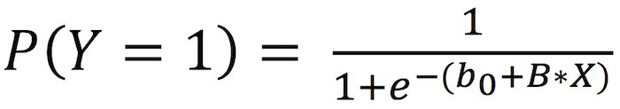
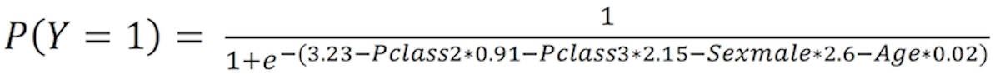

## Introduction
Logistic regression is a technique for modelling the probability of an event. Just like linear regression, it helps you understand the relationship between one or more variables and a target variable, except that, in this case, our target variable is binary: its value is either 0 or 1. For example, it can allow us to say that "smoking can increase your risk of having lung cancer by 20%", since having lung cancer is a binary variable: you either have it or not (hopefully not). From that, we can infer answers to classification problems. For example, it can help us make an educated guess of wether someone will have lung cancer given that he/she does not smoke, lives in a polluted city and has a family history of lung cancer.

With that said, the structure of a logistic regression is also similar to that of a linear regression model: you have a set of explanatory variables (X1, X2…) and our target binary variable (Y). The function behind it, however, is a bit more complicated:

<br>
<center>
{width=300px}
</center>
<br>

P(Y=1) represents the probability of your Y being equal to 1, while b0 is a parameter not linked to X and B is a vector of coefficients that represent the relationship between Y and each one of X1, X2 and so on.
The logistic regression will then estimate the values for the b parameters that better fit your data, usually using the maximum likelihood method. Once we have those estimators, we can calculate P(Y=1) for new data points and either stick with that probability or use it to classify those observations based on a threshold (ex.: if the probability of someone having lung cancer is greater than 50%, we can make an educated guess that they will have it).
To better understand the difference between a linear and a logistic regression, imagine we plotted the lung cancer variable in the Y-axis (Y = 1 if patient has lung cancer and 0 otherwise) and the patient's age in the X-axis. Below we have the resulting lines from each regression. Which one seems more fit to our data?


## Starting to get our hands dirty

One of the most famous datasets for working with classification problems is the Titanic dataset, where we have the list of the Titanic passengers, some of their characteristics, such as age, sex and name, and whether they have survived the disaster or not (for some reason, many classification problems tend to be related to bad things such as lung cancer and dying in a disaster). We'll be working in R, but you can do the same thing in Python if you want.
Let's first take a look at the available variables:


```{r}
# Loading our data
data = read.csv('data/train.csv')

# Taking a look at the column names
colnames(data)
```

So, besides the Id, we have some possibly useful information about them, such as their class in the ship (1st, 2nd or 3rd) and their sex.

** Data cleaning **
Before we start modelling, we have to clean our data. Keep in mind, however, that the goal of this article is to introduce logistic regressions, not data cleaning, so we are not going too deep in here.

```{r}
data$Age[is.na(data$Age)] = median(data$Age,na.rm=T) # replace missing values with the median
data$Pclass = as.factor(data$Pclass)
```

We have first replace missing ages by the median of the ages. Then, we turned the passenger class feature into a factor: this means that, instead of reading it as integers, R will read it as a category, which makes more sense in this case.

## Train/test split
Next step is to split our dataset into train and test, so we can build our model and then calculate some accuracy metrics in another dataset, that has not been used by our model. We have chosen an arbitrary size for the training set, but it usually is something around 70% and 80% of the original dataset.


```{r}
train = data[1:700,]
test = data[701:889,]
```

## Modelling
For our first model, let's choose variables that we intuitively believe could have some link with the probability of surviving the Titanic disaster. Personally, I would guess that the passenger's class, age and sex can help us predict if they survived or not:

```{r}
model = glm(Survived ~ Pclass + Sex + Age,
             family = binomial(link = 'logit'), data = train)
summary(model)
```

Wow, that's a lot of information at once, right? But let's focus on the basics for now, starting by how we build our model:

```{r echo = T, results = 'hide'}
glm(Survived ~ Pclass + Sex + Age, family = binomial(link = 'logit'), data = train)
```

We started by calling out a function called glm, that is used for fitting generalised linear models. To make it work specifically as a logistic regression, we set family = binomial and link = 'logit'. For our problem, we could also have set link to 'probit' or 'cochit', but we'll stick to the logit function. The difference between them is mainly theoretical and their results are usually fairly similar.

```{r echo = T, results = 'hide'}
# Coefficients:
#              Estimate Std. Error z value Pr(>|z|)    
# (Intercept)  3.226908   0.398636   8.095 5.73e-16 ***
# Pclass2     -0.908714   0.288174  -3.153 0.001614 ** 
# Pclass3     -2.153203   0.268262  -8.026 1.00e-15 ***
# Sexmale     -2.603025   0.209018 -12.454  < 2e-16 ***
# Age         -0.027199   0.008157  -3.334 0.000855 ***
```

Now, moving on to the coefficients, we can see that all of them are negative (look at the Estimate column), meaning that all these variables are negatively correlated with the probability of survival. That is: being a man or being in classes 2 or 3 (instead of being a woman or in class 1) made you less likely to survive the Titanic disaster. The age coefficient is also negative, so, the older you were the less likely you were to survive. To interpret the precise values of the coefficients, let's go back to our probability function:

<br>
<center>
{width=300px}
</center>
<br>

Here the Intercept coefficient is the b0 and the other coefficients are the vector B. Our model would look like this (I have rounded the coefficients for better readability):

<br>
<center>
{width=500px}
</center>
<br>

Where Pclass2 = 1 if the passenger was in class 2 and 0 otherwise (similarly for the other variables, except for Age, which is equal to the passenger's actual age). In addition to being part of our probability equation, they also help us interpret the odds: the coefficient of -2.6 for Sexmale means that the odds of surviving when you are a man are exp(-2.6) = 0.07 times the odds of surviving when you are a woman.
The other important column in that table is Pr(>|z|), which we call p-value. It shows us how confident we are that the estimated coefficient is significant (the closer it is to zero, the more confident we are). If we had some coefficients with high p-values, we should probably not include the related variables in our model.
Finally, the last item we'll talk about is the Akaike Information Criterion (AIC), shown at the end of the model summary. In simple terms, the AIC is an estimation of what our error would be if we applied our model to a test sample, and it helps us compare models (the smaller the AIC, the better).
Now, let's try a second model, adding the Fare variable (how much the passenger paid for the ticket):

```{r}
model2 = glm(Survived ~ Pclass + Sex + Age + Fare,
            family = binomial(link = 'logit'), data = train)
summary(model2)
```
Notice how the p-value for Fare is high, meaning that it is not a significant variable, and that the AIC has increased, meaning a slightly worse model. One possibility is that, since we already consider the passenger's  class, the ticket fare doesn't add much new information. To test this, let's run a third model, with the fare but removing Pclass:

```{r}
model3 = glm(Survived ~  Sex + Age + Fare,
             family = binomial(link = 'logit'), data = train)
summary(model3)
```

This time, our AIC is dramatically worse and Fare has a significant coefficient but Age is no longer significant. Any idea why that is? Comment your hypothesis here :)
Let's now apply our first model, which performed better than the following two, to the test sample to see how it goes:

```{r}
predictions = ifelse(predict(model, newdata = test) > 0.5, 1, 0)

accuracy = mean(predictions == test$Survived)
print(paste('Accuracy :', accuracy))
```

We started by applying our model to the test set, and stating that the passenger survived if the calculated probability is greater than 0.5. The first metric we calculated was accuracy, which represents our ratio of right predictions. An accuracy of 0.82 means that we got our predictions right 82% of the time. Not bad, right? Well, it depends. Imagine that 99% of the passengers had died. We could then predict that all passengers died, and our accuracy would be of 99% without needing a model for that. Therefore, we should somehow take into account the ratio of survivors in our metrics. That's where the ROC curve and the AUC come in.
ROC stands for Receiver Operating Characteristic, and  it's a plot of the True Positive Rate (probability of predicting 1 when the actual value is 1), against the False Positive Rate (probability of predicting 1 when the actual value is 0). When we plot that curve and calculate the area underneath it, we get the AUC, that stands for Area Under the Curve. That area is always between 0.5 and 1, which gives us a good scale to measure our model performance taking into account the sample distribution of 1's and 0's.
To perform these calculations in R, we need the ROCR package:

```{r, warning=FALSE,message=FALSE}
library(ROCR)

probabilities = predict(model, newdata = test)
prediction_object = prediction(probabilities, test$Survived)
roc = performance(prediction_object, measure = "tpr", x.measure = "fpr")
plot(roc)
```
<br>
The bigger the area underneath the curve, the better our model, so we want a curve that goes as close as possible to the top-left corner of the plot. Note in our code how we created it using the performance() function and used "fpr" for x.measure and "tpr" for measure. FPR stands for False Positive Rate and TPR for True Positive Rate. To calculate the AUC, we use the performance() function again, but we input "auc" as measure this time:

```{r}
perf_auc = performance(prediction_object, measure = "auc")
auc = perf_auc@y.values[[1]]
print(paste('AUC :', auc))
```
We have an AUC of 0.86, which is quite good for a classification problem.

## Conclusion
Logistic models are used for classification problems, and one of their advantages when compared to more complex alternatives is their interpretability: their results are easy to translate to layman's terms. We have seen how to run a logistic regression in R, understand its results, how to compare different models and evaluate their performance. As the title suggests, this is an introductory article, and I encourage you to dig deeper in all the possibilities that arise from it. You can start by trying to improve this model, by setting a different link for the glm() function or adding/removing variables. Maybe there's an automated way of doing it, like for linear regressions?
